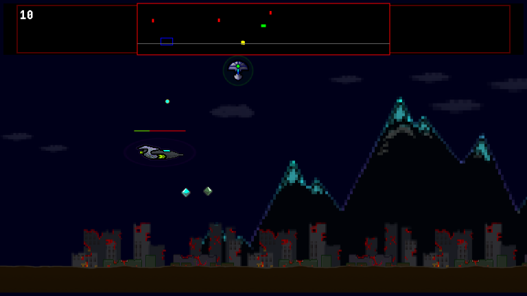

# sheepgate
eventually, sheep and gates!

An exercise in making an homage to Defender with the most over-wraught high-level-language constructs this side of Haskell. The code truly is an abomination, a result from trying an experiment in design (client-sever; internal database; etc.) to see where it might lead. (TODO: at least maybe try to use promises.)

* for something really impressive, check out this instead: https://keithclark.co.uk/articles/js1k-2015-defender/

but if you want to try this monstrosity, do something like:

# the new onering style.

This version is client-client, all-in-browser. _Note that all this won't work via a web **server** due to relative paths used in the code. It is for local use only.
(I did some symlinks on the web server to get it to work.)_

* have a unixy system (i use git bash on windows).
* have node and npm installed.
* bash ./runme-standalone.sh
* open onering/index.html in a browser.

# the old client-server style.

This version can be pretty slow when played remotely, especially on a resource constrained (ie free tier) server. Hence the client-client version above.

* have a unixy system (i use git bash on windows).
* have node and npm installed.
* bash ./runme-client-server.sh

# the old-old client-server style.

more "low level" if the runme script fails :-(

* build client in bash shell: cd OLD/client && npm i && (npx tsc -w &)
* build and run server in different bash shell: cd OLD/server && npm i && (npx tsc -w &) && npm run hot
* browser: open OLD/client/index.html

It is also currently running on an EC2 instance, so you can try it out - if there's room on the server.
Note that it is trying to round-trip a ton of json at 30FPS so don't be surprised if it is choppy.
[Play the game here](http://18.190.219.255/)

