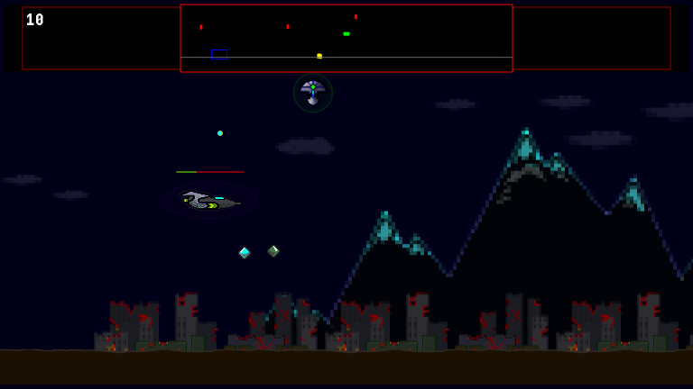

# sheepgate
eventually, sheep and gates!

try something like:
* build client in bash shell: cd OLD/client && npm i && (./node_modules/typescript/bin/tsc -w &)
* build and run server in different bash shell: cd OLD/server && npm i && (./node_modules/typescript/bin/tsc -w &) && npm run hot
* browser: open OLD/client/index.html

# WARNING

The code is an bit of an abomination resulting from trying an experiment in design to see where it might lead.

